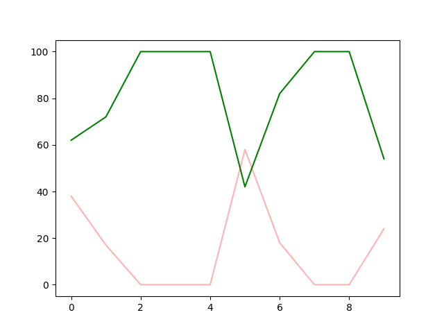

# Model-Based-RL

## AlphaZero

This is the final trained Network in play against a Human Opponent.

### Play

To play against the Algorithm, clone this repository on your local machine, *make sure you have python 3 or higher as well as PyTorch installed*.

Then Run the Python Script [Play.py](AlphaZero/Play.py) in the AlphaZero Folder

### Overview

AlphaZero uses a Neural Network as a value approximator, this Network works in Conjunction with Monte Carlo Tree Search (**MCTS**)

### Network Architecture

The Exact architecture can be found in [Nets.py](AlphaZero/Nets.py)

The Graph Below shows how the Networks Perform Compared to their previous networks, during training:  

This graph implies that, except for network number 5 (*compared to network number 4*), there was an improvement every network.

